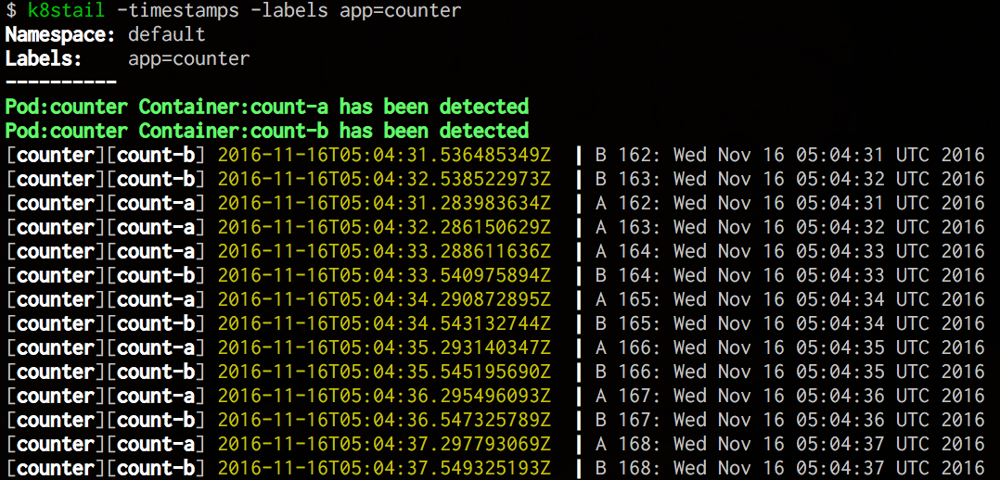

# k8stail

[](https://travis-ci.org/dtan4/k8stail)

`tail -f` experience for Kubernetes Pods

As you know, `kubectl logs` can stream only ONE pod at the same time. `k8stail` enables you to watch __log streams of ALL pods__ in the specified namespace or labels in real time, like `tail -f`.



## Installation

### Using Homebrew (OS X only)

Formula is available at [dtan4/homebrew-dtan4](https://github.com/dtan4/homebrew-dtan4).

```bash
$ brew tap dtan4/dtan4
$ brew install k8stail
```

### Precompiled binary

Precompiled binaries for Windows, OS X, Linux are available at [Releases](https://github.com/dtan4/k8stail/releases).

### From source

```bash
$ go get -d github.com/dtan4/k8stail
$ cd $GOPATH/src/github.com/dtan4/k8stail
$ make deps
$ make install
```

## Usage

Logs of all pods, all containers in pod in the specified namespace are streaming. When new pod is added, logs of the pod also appears.

```bash
$ k8stail -namespace awesome-app
Namespace: awesome-app
Labels:
----------
Pod awesome-app-web-4212725599-67vd4 has detected
Pod awesome-app-web-4212725599-6pduy has detected
Pod awesome-app-web-4212725599-lbuny has detected
Pod awesome-app-web-4212725599-mh3g1 has detected
Pod awesome-app-web-4212725599-pvjsm has detected
[awesome-app-web-4212725599-mh3g1][web]  | creating base compositions...
[awesome-app-web-4212725599-zei9h][web]  |    (47.1ms)  CREATE TABLE "schema_migrations" ("version" character varying NOT NULL)
[awesome-app-web-4212725599-zei9h][web]  |    (45.1ms)  CREATE UNIQUE INDEX  "unique_schema_migrations" ON "schema_migrations"  ("version")
[awesome-app-web-4212725599-zei9h][web]  |   ActiveRecord::SchemaMigration Load (1.8ms)  SELECT "schema_migrations".* FROM "schema_migrations"
[awesome-app-web-4212725599-zei9h][web]  | Migrating to CreatePosts (20160218082522)
```

With `-timestamps` option, log timestamp is printed together.


```bash
$ k8stail -namespace awesome-app -timestamps
Namespace: awesome-app
Labels:
----------
Pod awesome-app-web-4212725599-67vd4 has detected
Pod awesome-app-web-4212725599-6pduy has detected
Pod awesome-app-web-4212725599-lbuny has detected
Pod awesome-app-web-4212725599-mh3g1 has detected
Pod awesome-app-web-4212725599-pvjsm has detected
[awesome-app-web-4212725599-mh3g1][web] 2016-11-15T10:57:22.178667425Z  | creating base compositions...
[awesome-app-web-4212725599-zei9h][web] 2016-11-15T10:57:22.309011520Z  |    (47.1ms)  CREATE TABLE "schema_migrations" ("version" character varying NOT NULL)
[awesome-app-web-4212725599-zei9h][web] 2016-11-15T10:57:22.309053601Z  |    (45.1ms)  CREATE UNIQUE INDEX  "unique_schema_migrations" ON "schema_migrations"  ("version")
[awesome-app-web-4212725599-zei9h][web] 2016-11-15T10:57:22.463700110Z  |   ActiveRecord::SchemaMigration Load (1.8ms)  SELECT "schema_migrations".* FROM "schema_migrations"
[awesome-app-web-4212725599-zei9h][web] 2016-11-15T10:57:22.463743373Z  | Migrating to CreatePosts (20160218082522)
```

With `-labels` option, you can filter pods to watch.

```bash
$ k8stail -namespace awesome-app -labels name=awesome-app-web
Namespace: awesome-app
Labels:    name=awesome-app-web
----------
Pod awesome-app-web-4212725599-67vd4 has detected
Pod awesome-app-web-4212725599-6pduy has detected
Pod awesome-app-web-4212725599-lbuny has detected
Pod awesome-app-web-4212725599-mh3g1 has detected
Pod awesome-app-web-4212725599-pvjsm has detected
[awesome-app-web-4212725599-mh3g1][web]  | creating base compositions...
[awesome-app-web-4212725599-zei9h][web]  |    (47.1ms)  CREATE TABLE "schema_migrations" ("version" character varying NOT NULL)
[awesome-app-web-4212725599-zei9h][web]  |    (45.1ms)  CREATE UNIQUE INDEX  "unique_schema_migrations" ON "schema_migrations"  ("version")
[awesome-app-web-4212725599-zei9h][web]  |   ActiveRecord::SchemaMigration Load (1.8ms)  SELECT "schema_migrations".* FROM "schema_migrations"
[awesome-app-web-4212725599-zei9h][web]  | Migrating to CreatePosts (20160218082522)
```

### kubeconfig file

`k8stail` uses `~/.kube/config` as default. You can specify another path by `KUBECONFIG` environment variable or `-kubeconfig` option. `-kubeconfig` option always overrides `KUBECONFIG` environment variable.

```bash
$ KUBECONFIG=/path/to/kubeconfig k8stail
# or
$ k8stail -kubeconfig=/path/to/kubeconfig
```

### Options

|Option|Description|Required|Default|
|---------|-----------|-------|-------|
|`-kubeconfig=KUBECONFIG`|Path of kubeconfig||`~/.kube/config`|
|`-labels=LABELS`|Label filter query (e.g. `app=APP,role=ROLE`)|||
|`-namespace=NAMESPACE`|Kubernetes namespace||`default`|
|`-timestamps`|Include timestamps on each line||`false`|
|`-h`, `-help`|Print command line usage|||
|`-v`, `-version`|Print version|||

## Development

Clone this repository and build using `make`.

```bash
$ go get -d github.com/dtan4/k8stail
$ cd $GOPATH/src/github.com/dtan4/k8stail
$ make
```

## Author

Daisuke Fujita ([@dtan4](https://github.com/dtan4))

## License

[](LICENSE)
